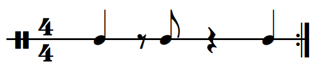

# rhythmicon-vue

> Vue components to display and interact with rhythmic patterns

## Table of Contents

- [Install](#install)
- [Usage](#usage)
- [Components](#components)
- [Maintainers](#maintainers)
- [Contributing](#contributing)
- [License](#license)

## Install

```bash
npm install rhythmicon-vue
```

## Usage

~~~js 
import { RhythmCircle, RhythmScore } from "rhythmicon-vue"
~~~

## Components

Rhythms must be provided as array of pulses, each being either a beat (value `1`) or a rest (value `0`), for instance `[1,0,0,1,0,0,1,0]` for the tresillo rhythm. See package `rhythmicon-rhythm` for an extension of this data structure as class.

### RhythmInput

A text input field to show and edit a rhythm pattern. Editing is submitted on Enter or aborted on Esc.

~~~html
<RhythmInput v-model="rhythm" />
~~~

### RhythmCircle

A circular visualization of a rhythm as SVG image. Pulses are spread evenly around the circle as dots. A pulse can be toggled to represent a beat or a rest by clicking on the dot.

~~~html
<RhythmCircle :rhythm="rhythm" :pulse="pulse" @toggle="toggle" />
~~~


**Properties:**

- `rhythm`: the rhythm to display (Array or instance of Rhythm)
- `pulse`: index of the currently active pulse (optional)
- `@toggle`: event emitted when a pulse is toggled

The layout can be configured with the following CSS classes:

- `rhythm-circle` for the SVG root element
- `beat-dot` for a dot representing a beat
- `rest-dot` for a dot representing a rest
- `active` for the active dot when property `pulse` is set
- `polygon` for the inner polygon connecting beat dots

## RhythmScore

A staff with notes and rests to show a rhythm. Details depend on time signature, this is still being worked on!

Requires the [Bravura font](https://www.smufl.org/fonts/) to be loaded.

Implementation is based on an [idea Stephen Band](https://cruncher.ch/blog/printing-music-with-css-grid/). See his library [Scribe](https://github.com/stephband/scribe/) for a more sophisticated music rendering.

~~~html
<RhythmScore :rhythm="rhythm" />
~~~



**Properties:**

- `rhythm`: the rhythm to display (Array or instance of Rhythm)
- `pulse`: index of the currently active pulse (optional)
- `@toggle`: event emitted when a note or rest is clicked on

## Maintainers

- [@nichtich](https://github.com/nichtich) (Jakob Voß)

## Contributing

Contributions are welcome! Best use [the rhythmicon issue tracker](https://github.com/nichtich/rhythmicon/issues) for questions, bug reports, and/or feature requests!

## License

MIT license
